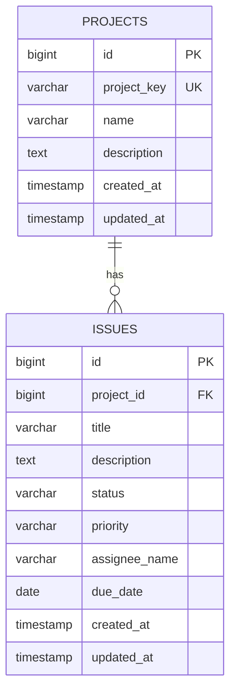

# 01 要件定義

## 1. アプリ概要

- **プロジェクト名**: ProjectFlow
- **アプリケーション表示名**: ProjectFlow
- **リポジトリ名**: project-management-app
- **作成日**: 2026年7月5日
- **更新者**: Codex / 開発支援
- **目的・背景**: ProjectFlow は、Backlog や Jira のようなプロジェクト管理ツールを参考にした学習用Webアプリケーションである。複数プロジェクトと課題の状態を一元管理し、プロジェクト単位の進捗確認、課題の登録・更新・削除・検索をブラウザから行えるようにする。
- **ゴール**: MVPとして、プロジェクト管理、課題管理、ダッシュボードが実DBと連携して動作し、ローカル環境で `frontend` から `backend` のREST APIを呼び出して基本操作を完了できる状態にする。

## 2. プロジェクト方針

- 社内情報、顧客情報、個人情報、機密情報は含めない。
- Backlog や Jira の完全コピーではなく、ProjectFlow 独自の表現にする。
- MVPでは認証・認可を実装しない。
- REST API のパスは `/api` 配下に統一する。
- Spring Data JPA は使用せず、MyBatis を使用する。
- DB初期化は `backend/src/main/resources/sql/schema.sql` と `backend/src/main/resources/sql/data.sql` で行う。
- Flyway / Liquibase はMVPでは導入しない。

## 3. 対象ユーザー

- **ターゲットユーザー**: 小規模な開発チーム、学習者、プロジェクト管理ツールの基本構造を学ぶ開発者。
- **管理者**: MVPでは管理者専用機能は設けない。ローカル開発者がDB、アプリケーション設定、初期データを管理する。
- **外部連携先**: MVPでは外部サービス連携は行わない。将来的には通知、CSV出力、認証基盤などの連携を検討する。

## 4. 現在のスコープ

- **現状の課題（As-Is）**: 学習用プロジェクトでは、プロジェクト情報と課題情報がドキュメントやモック画面に分散し、実DBを使った登録・更新・削除・検索の流れを確認しづらい。ダッシュボードも固定値では、実際の課題状態を把握できない。
- **目指す姿（To-Be）**: プロジェクトと課題をDBに永続化し、画面からCRUD操作と絞り込みを実行できる。ダッシュボードでは件数サマリーと最近更新された課題を確認できる。
- **スコープ（開発範囲）**: 今回はプロジェクト管理、課題管理、ダッシュボード、REST API、PostgreSQL向けDB定義、Vue画面を対象とする。

## 5. 対象外スコープ

MVPでは以下を対象外とする。ただし、今後の追加開発候補として扱ってよい。

- 認証・ログイン
- 認可・権限管理
- ユーザー管理
- コメント
- 添付ファイル
- タグ
- 通知
- Wiki
- 課題変更履歴
- CSV出力
- 帳票出力
- ガントチャート
- 本格的なカンバンボード
- メール送信
- 外部サービス連携

## 6. 実装済み機能

| No. | 機能名 | 概要 | 詳細・入出力仕様 | 優先度 |
|---|---|---|---|---|
| 1 | ヘルスチェック | バックエンドの稼働状態を確認する | 入力なし。`{"status":"UP"}` を返す。 | Must |
| 2 | ダッシュボード表示 | 全体状況を集計表示する | プロジェクト数、課題数、ステータス別件数、最近更新された課題を表示する。 | Must |
| 3 | プロジェクト一覧 | 登録済みプロジェクトを一覧表示する | ID、プロジェクトキー、名称、説明、更新日時を表示する。 | Must |
| 4 | プロジェクト登録 | 新規プロジェクトを登録する | プロジェクトキー、名称、説明を入力する。プロジェクトキーは重複不可。 | Must |
| 5 | プロジェクト編集 | 既存プロジェクトを更新する | 指定IDのプロジェクト情報を更新する。自分以外のプロジェクトキーとの重複は不可。 | Must |
| 6 | プロジェクト削除 | 既存プロジェクトを削除する | 課題が存在するプロジェクトは削除不可とし、400エラーを返す。 | Must |
| 7 | 課題一覧 | 登録済み課題を一覧表示する | ID、プロジェクトキー、件名、ステータス、優先度、担当者、期限日、更新日時を表示する。 | Must |
| 8 | 課題絞り込み | 課題一覧を条件で絞り込む | `projectId` と `status` を条件に課題一覧を取得する。 | Must |
| 9 | 課題登録 | 新規課題を登録する | プロジェクト、件名、説明、ステータス、優先度、担当者名、期限日を入力する。存在しないプロジェクトIDは404エラー。 | Must |
| 10 | 課題編集 | 既存課題を更新する | 指定IDの課題情報を更新する。ステータスと優先度は定義済みEnumを使用する。 | Must |
| 11 | 課題削除 | 既存課題を削除する | 指定IDの課題を削除する。存在しないIDは404エラー。 | Must |
| 12 | 課題詳細 | 課題の詳細情報を表示する | プロジェクト名、プロジェクトキー、件名、説明、ステータス、優先度、担当者名、期限日、作成日時、更新日時を表示する。 | Must |
| 13 | 共通エラーハンドリング | APIエラーを統一形式で返す | `message` と `details` を持つJSONを返す。バリデーションエラーは項目別エラーを `details` に含める。 | Must |

## 7. 画面一覧

| 画面ID | 画面名 | 概要 |
|---|---|---|
| SCR-001 | ダッシュボード | バックエンド接続状態、件数サマリー、最近更新された課題を表示する。 |
| SCR-002 | プロジェクト一覧 | プロジェクト一覧、編集、削除、新規作成導線を表示する。 |
| SCR-003 | プロジェクト登録 | プロジェクトキー、名称、説明を登録する。 |
| SCR-004 | プロジェクト編集 | 既存プロジェクトを編集する。 |
| SCR-005 | 課題一覧 | 課題一覧、絞り込み、詳細、編集、削除、新規作成導線を表示する。 |
| SCR-006 | 課題登録 | 課題を登録する。 |
| SCR-007 | 課題詳細 | 課題の詳細項目を表示する。 |
| SCR-008 | 課題編集 | 既存課題を編集する。 |

## 8. 機能要件一覧

### API一覧

| エンドポイント | メソッド | 概要 |
|---|---|---|
| `/api/health` | GET | ヘルスチェック |
| `/api/dashboard` | GET | ダッシュボード集計取得 |
| `/api/projects` | GET | プロジェクト一覧取得 |
| `/api/projects/{id}` | GET | プロジェクト詳細取得 |
| `/api/projects` | POST | プロジェクト登録 |
| `/api/projects/{id}` | PUT | プロジェクト更新 |
| `/api/projects/{id}` | DELETE | プロジェクト削除 |
| `/api/issues` | GET | 課題一覧取得。`projectId`, `status` で絞り込み可能。 |
| `/api/issues/{id}` | GET | 課題詳細取得 |
| `/api/issues` | POST | 課題登録 |
| `/api/issues/{id}` | PUT | 課題更新 |
| `/api/issues/{id}` | DELETE | 課題削除 |

### データ要件

- ステータスは `TODO`, `IN_PROGRESS`, `REVIEW`, `DONE` を使用する。
- 優先度は `LOW`, `MEDIUM`, `HIGH` を使用する。
- 課題が存在するプロジェクトは削除できない。

### 非機能要件

- ローカル開発環境で起動できることを前提とする。
- 商用運用の冗長化、SLA、障害復旧設計はMVP対象外とする。
- 初期データ数件から小規模利用を想定する。
- 検索頻度が高い `projects.project_key`, `issues.project_id`, `issues.status`, `issues.updated_at` にインデックスを設定する。
- CORSはローカル開発用に `http://localhost:5173` を許可する。

## 9. 追加開発候補

### 初級

- 課題一覧に優先度絞り込みを追加する
- 課題一覧に期限切れラベルを表示する
- 課題一覧の並び順を変更できるようにする
- ダッシュボードに期限切れ件数を表示する
- プロジェクト一覧に課題件数を表示する
- 入力フォームの補助メッセージを改善する

### 初中級

- コメント機能を追加する
- 課題ステータス変更履歴を追加する
- 担当者マスタを追加する
- タグ機能を追加する
- 課題一覧に複合検索条件を追加する
- プロジェクトごとの課題サマリーを表示する

### 中級

- カンバンボード画面を追加する
- CSV出力機能を追加する
- 簡易ログイン機能を追加する
- プロジェクト別ダッシュボードを追加する
- ページングを追加する
- 課題一括更新機能を追加する

### やや難しい

- 添付ファイル機能
- 通知機能
- 権限管理
- Wiki機能
- ガントチャート機能
- 外部サービス連携

## 10. 要件追加テンプレート

追加要件を検討・実装する場合は、以下のテンプレートをコピーして追記する。

---

### REQ-xxx: 機能名

#### 背景

この機能が必要になった背景を記載する。

例:
現在は課題一覧でステータスによる絞り込みはできるが、優先度では絞り込みできない。
優先度の高い課題を確認しやすくするため、優先度絞り込みを追加する。

#### 目的

この機能で実現したいことを記載する。

#### 対応内容

実装する内容を箇条書きで記載する。

-
-
-

#### 受入条件

完了判断できる条件を記載する。

-
-
-

#### 画面影響

影響する画面を記載する。

- なし
- あり:

#### API影響

影響するAPIを記載する。

- なし
- あり:

#### DB影響

DB変更の有無を記載する。

- なし
- あり:

#### Backend影響

変更が想定されるbackendのレイヤーを記載する。

- Controller
- Service
- Dao
- Mapper
- DTO
- Model
- Exception
- Config
- なし

#### Frontend影響

変更が想定されるfrontendのファイルや責務を記載する。

- View
- API client
- Type definition
- Router
- Component
- なし

#### docs更新対象

更新が必要なdocsにチェックする。

- [ ] 01_要件定義.md
- [ ] 03_画面一覧.md
- [ ] 04_API一覧.md
- [ ] 05_DB設計.md
- [ ] 06_コーディング規約.md
- [ ] 08_レビュー観点.md
- [ ] 09_環境構築手順書.md
- [ ] 00_Dify入力用_要件コンテキスト.md
- [ ] 更新不要

#### テスト観点

確認する観点を記載する。

- 正常系:
- 異常系:
- 画面表示:
- API:
- DB:

#### 想定難易度

以下から選択する。

- 初級
- 初中級
- 中級
- やや難しい

#### 想定作業者

以下から選択する。

- 2年目向け
- 3年目向け
- 4〜5年目向け
- リーダー確認推奨

#### 備考

補足事項や確認事項を記載する。

## 11. 要件記載ルール

追加要件を書くときは、以下を守る。

- 1つの要件は、2〜5年目のエンジニアが1〜3日程度で対応できる粒度にする。
- 大きすぎる要件は複数の要件に分割する。
- 実装済み機能と重複する要件を追加しない。
- 背景、目的、対応内容、受入条件を必ず書く。
- 画面、API、DB、Backend、Frontend、docs の影響範囲を明記する。
- DB変更がある場合は `05_DB設計.md` も更新する。
- API変更がある場合は `04_API一覧.md` も更新する。
- 画面追加・変更がある場合は `03_画面一覧.md` も更新する。
- 実装ルールを変更する場合は `06_コーディング規約.md` も更新する。
- Difyの入力判断に影響する大きな変更がある場合は `00_Dify入力用_要件コンテキスト.md` も更新する。
- 社内情報、顧客情報、個人情報、機密情報は記載しない。
- BacklogやJiraの完全コピーになる表現は避ける。
- 不明点は推測せず、確認事項として記載する。

## 12. 変更履歴

| 日付 | バージョン | 更新内容 | 更新者 |
|---|---|---|---|
| 2026.07.05 | v0.1 | MVP実装内容に基づき要件定義書を新規作成 | Codex / 開発支援 |
| 2026.07.05 | v0.1.0 MVP | プロジェクトCRUD API、課題CRUD API、ダッシュボード集計API、PostgreSQL向けDB定義、MyBatis Mapper XML、Vue 3画面、課題一覧絞り込み、共通エラーハンドリングを追加。認証・認可を対象外とし、APIパスを `/api` 配下へ統一。 | Codex / 開発支援 |
| 2026.07.10 | v0.2 | docs構成整理に伴い、決定事項とリリース内容を本書へ統合し、追加要件テンプレートと記載ルールを追加 | Codex / 開発支援 |
