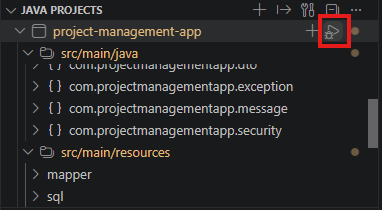

# 07 環境構築手順書（Windows版）

作成日: 2026-07-04
更新日: 2026-08-02

## 1. 対象プロジェクト

この手順書は、Windows の社用PCで `project-management-app` を初回構築し、ローカル環境で開発・起動確認するための手順です。

```text
project-management-app/
├─ backend/   Java 21 + Spring Boot + Maven
├─ frontend/  Vue 3 + Vite + TypeScript
└─ docs/      設計書・手順書
```

以降のコマンドは、すべてコマンドプロンプトで実行する前提です。

## 2. 必要なインストール資源

未インストールの場合は、以下をインストールしてください。

| 資源 | 用途 | 備考 |
| --- | --- | --- |
| Visual Studio Code | 開発エディタ | Java / Vue / Spring Boot 開発で使用 |
| Git for Windows | ソース管理 | `git clone`、差分確認、コミットで使用 |
| JDK 21 | Backend 実行・ビルド | `JAVA_HOME` を JDK 21 に設定 |
| Apache Maven 3.9.16 | Backend 依存関係解決・起動 | このリポジトリには Maven Wrapper は含まれていないため、Maven 本体が必要 |
| Node.js 22 系 | Frontend 実行・ビルド | npm 同梱版を使用 |
| PostgreSQL 16.14 | ローカル DB | EnterpriseDB のダウンロードページから 16.14 を選択 |
| pgAdmin または psql | DB 操作 | DB・ユーザー作成、接続確認で使用 |

### 2.1 Visual Studio Code のインストール

Visual Studio Code が未インストールの場合は、以下のダウンロードページを開きます。

```text
https://code.visualstudio.com/download
```

Windows 用のインストーラーをダウンロードして実行します。

インストール時は、以下の項目を有効にすることを推奨します。

| 項目 | 設定 |
| --- | --- |
| PATH への追加 | 有効 |
| エクスプローラーのファイル コンテキスト メニューに追加 | 任意 |
| エクスプローラーのディレクトリ コンテキスト メニューに追加 | 任意 |
| サポートされているファイルのエディターとして Code を登録 | 任意 |

インストール後、コマンドプロンプトで以下を実行し、VS Code が起動できることを確認します。

```cmd
code --version
```

### 2.2 Git for Windows のインストール

Git for Windows が未インストールの場合は、以下のページからインストーラーをダウンロードして実行します。

```text
https://gitforwindows.org/
```

インストール中に確認メッセージが表示された場合は、内容を確認して続行します。特に変更が不要な場合は、既定値のままインストールします。

インストール後、コマンドプロンプトを開き直して以下を実行し、Git が利用できることを確認します。

```cmd
git --version
```

Git のバージョンが表示されれば問題ありません。

### 2.3 リポジトリの取得

GitHubから `project-management-app` を取得します。  
あらかじめ、任意の作業フォルダを用意しておき、ディレクトリを移動しておくとよいです。

```cmd
git clone https://github.com/projectflowAdmin/project-management-app.git
cd project-management-app
```

アクセスできない場合は、以下を確認してください。

- GitHubアカウントでログインできていること
- 対象リポジトリへのアクセス権限があること
- GitHub Organizationに参加済みであること

## 3. VS Code 拡張機能

開発に必要な VS Code 拡張機能は以下です。

| 拡張機能 ID | 用途 |
| --- | --- |
| `ms-ceintl.vscode-language-pack-ja` | VS Code 日本語化 |
| `vscjava.vscode-java-pack` | Java 開発パック |
| `vmware.vscode-boot-dev-pack` | Spring Boot 開発パック |
| `vue.volar` | Vue / TypeScript サポート |

別端末で同じ拡張機能を入れる場合は、コマンドプロンプトで以下を実行します。  
VSCodeの拡張機能アイコンから検索してインストールしても問題ありません。

```cmd
code --install-extension ms-ceintl.vscode-language-pack-ja
code --install-extension vscjava.vscode-java-pack
code --install-extension vmware.vscode-boot-dev-pack
code --install-extension vue.volar
```

## 4. VS Code ワークスペース設定

現在の `.vscode/settings.json` には以下が設定されています。

```json
{
  "java.compile.nullAnalysis.mode": "automatic",
  "java.configuration.updateBuildConfiguration": "automatic"
}
```

VS Code の「実行とデバッグ」アイコンから `Backend: Spring Boot` または `ProjectFlow: Backend + Frontend` を選択して開始すると、以下を同時に起動できます。

- Backend: Spring Boot
- Frontend: `npm.cmd run dev`

Spring Boot Dashboard のアプリ単体起動ボタンは、基本的にBackend単体の起動に使用します。
Frontendも同時に起動したい場合は、上記の `ProjectFlow: Backend + Frontend` を使用してください。

## 5. Backend 環境構築

### 5.1 Java 21 のインストール

JDK 21 が未インストールの場合は、JDK 21 の Windows x64 インストーラーをダウンロードしてインストールします。

例:

```text
https://download.oracle.com/java/21/latest/jdk-21_windows-x64_bin.exe
```

インストール後、`JAVA_HOME` を JDK 21 のインストール先に設定し、`Path` に `%JAVA_HOME%\bin` を追加します。

Windowsの検索で「環境変数」と入力すると「環境変数を編集」が表示されるため、そちらから環境変数設定画面を表示できます。  
`Path`という変数定義が無ければ新たに作成し、存在する場合は選択した状態で編集を押してください。

以下はJAVA_HOME用の変数にJDKのパス設定し、Path変数にJAVA_HOMEを参照させる設定にしている例です。

例:

```text
JAVA_HOME=C:\Program Files\Java\jdk-21
Path=%JAVA_HOME%\bin
```

既に Java 21 が入っている場合も、`JAVA_HOME` が Java 21 を指していることを確認してください。

### 5.2 Maven 3.9.16 のインストール

Maven が未インストールの場合は、Apache Maven 3.9.16 の binary zip をダウンロードして展開します。

```text
https://dlcdn.apache.org/maven/maven-3/3.9.16/binaries/apache-maven-3.9.16-bin.zip
```

参照元:

```text
https://maven.apache.org/download.cgi
```

展開後、Maven の配置先を `MAVEN_HOME` に設定し、`Path` に `%MAVEN_HOME%\bin` を追加します。

例:

```text
MAVEN_HOME=C:\apache-maven-3.9.16
Path=%MAVEN_HOME%\bin
```

既に Maven が入っている場合も、`mvn -version` で 3.9 系が利用されていることを確認してください。

### 5.3 Java / Maven の確認

コマンドプロンプトを開き直して以下を実行します。

```cmd
java -version
mvn -version
```

Java は 21 系、Maven は 3.9 系が表示されれば問題ありません。

### 5.4 PostgreSQL 16.14 のインストール

PostgreSQL が未インストールの場合は、以下の EnterpriseDB のダウンロードページを開き、Windows 用の PostgreSQL `16.14` を選択してインストールします。

```text
https://www.enterprisedb.com/downloads/postgres-postgresql-downloads
```

インストール時の主な設定は以下を推奨します。

| 項目 | 設定 |
| --- | --- |
| Version | 16.14 |
| Port | 5432 |
| Locale | Default locale |
| Stack Builder | 必須ではないため未選択で可 |

PostgreSQLインストール時に、`postgres` ユーザーのパスワードを設定します。以降の設定例ではローカル開発用に `postgres` を使用しますが、別のパスワードを設定しても問題ありません。その場合は、後述の `application-local.yml` に実際のパスワードを記載してください。

### 5.5 PostgreSQL サービスの起動確認

Windowsの「サービス」アプリを開き、`postgresql-x64-16` が「実行中」になっていることを確認します。

コマンドプロンプトで確認する場合は、以下を実行します。

```cmd
sc query postgresql-x64-16
```

`STATE` が `RUNNING` であれば起動しています。

PostgreSQLのバージョンやインストール方法によって、サービス名は異なる場合があります。
サービス名が異なる場合は、Windowsの「サービス」アプリで実際のサービス名を確認してください。

### 5.6 DB 接続設定

DB接続情報は、Git管理対象外の `backend/src/main/resources/application-local.yml` に設定します。

以下の手順でローカル用設定ファイルを作成してください。

1. VS Codeのエクスプローラーで `backend/src/main/resources` フォルダーを開く
2. `resources` フォルダーを右クリックし、「新しいファイル」を選択する
3. ファイル名に `application-local.yml` を入力する
4. 下記のYAMLを記載して保存する

```text
backend/
└─ src/
   └─ main/
      └─ resources/
         ├─ application.yml
         └─ application-local.yml
```

`application-local.yml` に以下を記載します。

```yaml
spring:
  datasource:
    url: jdbc:postgresql://localhost:5432/postgres?currentSchema=management_app
    username: postgres
    password: postgres
    driver-class-name: org.postgresql.Driver
```

上記はローカル開発用の設定例です。PostgreSQLインストール時に別のパスワードを設定した場合は、`password` を実際の値に変更します。

`application-local.yml` は `.gitignore` の対象であり、Gitへコミットしないでください。このファイルは `resources` 配下にあるため、ローカルでJARを作成するとJAR内に含まれます。`application-local.yml` を含むローカルビルドのJARは共有・公開しないでください。

`application.yml` で `local` を既定プロファイルとしているため、ローカル起動時に追加のプロファイル指定は不要です。共有環境や本番環境では `application-local.yml` を使用せず、`SPRING_DATASOURCE_URL`、`SPRING_DATASOURCE_USERNAME`、`SPRING_DATASOURCE_PASSWORD` を環境側から設定してください。

### 5.7 DB 初期構築SQL

このプロジェクトでは、Backend起動時にSQLは自動実行しません。
初回構築時は、Backend起動前に `backend/src/main/resources/sql/init` 配下のSQLを `001` から番号順に手動実行してください。

```yaml
spring:
  sql:
    init:
      mode: never
```

Flyway / Liquibase / 独自Java migration runner は使用しません。

`init` 配下のSQLは新規環境の初期構築用です。
既存環境では、内容と影響を確認せずに安易に再実行しないでください。

`changes` 配下は、テーブル追加、カラム追加、インデックス追加などの追加変更SQLを配置する場所です。
追加変更SQLは採番順に手動実行し、`management_app.sql_history` で適用履歴を確認します。
`sql_history` は手動適用履歴を確認するための簡易テーブルであり、SQLを自動実行する仕組みではありません。

リポジトリのルートディレクトリで以下を実行します。

```cmd
psql -h localhost -p 5432 -U postgres -d postgres -f backend\src\main\resources\sql\init\001_create_schema.sql
psql -h localhost -p 5432 -U postgres -d postgres -f backend\src\main\resources\sql\init\002_create_projects_table.sql
psql -h localhost -p 5432 -U postgres -d postgres -f backend\src\main\resources\sql\init\003_create_issues_table.sql
psql -h localhost -p 5432 -U postgres -d postgres -f backend\src\main\resources\sql\init\004_create_indexes.sql
psql -h localhost -p 5432 -U postgres -d postgres -f backend\src\main\resources\sql\init\005_create_sql_history.sql
psql -h localhost -p 5432 -U postgres -d postgres -f backend\src\main\resources\sql\init\006_insert_initial_data.sql
```

実行後、以下でテーブルが作成されていることを確認できます。

```cmd
psql -h localhost -p 5432 -U postgres -d postgres
```

psql 接続後に以下を実行します。

```sql
\dt management_app.*
```

初期データの件数を確認する場合は、psql 接続後に以下を実行します。

```sql
SELECT COUNT(*) FROM management_app.projects;
SELECT COUNT(*) FROM management_app.issues;
```

SQL適用履歴を確認する場合は、psql 接続後に以下を実行します。

```sql
SELECT
    script_no,
    script_name,
    description,
    executed_at,
    executed_by
FROM management_app.sql_history
ORDER BY script_no;
```

### 5.8 Backend 起動

リポジトリのルートディレクトリから以下を実行します。

```cmd
cd backend
mvn spring-boot:run
```

別のコマンドプロンプトまたはブラウザで以下にアクセスして確認します。

```text
http://localhost:8080/api/health
```

このプロジェクトでは独自の Health API として `/api/health` を使用します。
Spring BootとDBの状態確認には、Spring Boot Actuatorの `/actuator/health` も利用できます。

正常な場合は、以下のようなJSONが返ります。

```json
{"status":"UP"}
```

### 5.9 Talend API Testerの導入とAPI確認

GET以外のメソッドやJSONリクエストボディを含むAPIの手動確認には、Chrome拡張機能の `Talend API Tester - Free Edition` を使用します。

1. Chromeで以下のChromeウェブストアを開きます。
   - [Talend API Tester - Free Edition](https://chromewebstore.google.com/detail/talend-api-tester-free-ed/aejoelaoggembcahagimdiliamlcdmfm)
2. 「Chromeに追加」を押し、表示される権限を確認してインストールします。
3. Chromeの拡張機能一覧から `Talend API Tester` を起動します。
4. 以下のリクエストを設定して `Send` を押します。

| 項目 | 設定値 |
| --- | --- |
| Method | `GET` |
| URL | `http://localhost:8080/api/health` |
| Request Body | なし |

HTTPステータス `200 OK` と以下のJSONが返れば、独自Health APIの確認は完了です。

```json
{"status":"UP"}
```

> **注意:** ローカル開発用データのみを使用し、実際のパスワード、APIキー、顧客情報などは入力しないでください。利用前に所属組織のブラウザ拡張機能ポリシーも確認してください。

## 6. Frontend 環境構築

### 6.1 Node.js 22系のインストール

Node.js が未インストールの場合は、Node.js公式サイトから Windows 用インストーラーをダウンロードしてインストールします。

```text
https://nodejs.org/
```

LTS版または指定された Node.js 22系を選択してください。
インストール時は、npmも一緒にインストールされます。
特別な理由がなければ既定値のまま進めてください。

### 6.2 Node.js / npm の確認

コマンドプロンプトを開き直して以下を実行します。

```cmd
node -v
npm -v
```

Node.js は 22 系が表示され、npm のバージョンも表示されれば問題ありません。

### 6.3 依存関係インストール

リポジトリのルートディレクトリから以下を実行します。

```cmd
cd frontend
npm ci
```

このリポジトリには `frontend/package-lock.json` が含まれているため、初回構築やCIに近い確認では `npm ci` を使用します。
依存関係を追加・更新する場合は、変更内容を確認したうえで `npm install` を使用してください。

### 6.4 Frontend 起動

`frontend` ディレクトリで以下を実行します。

```cmd
npm run dev
```

起動後、ブラウザで以下にアクセスします。

```text
http://localhost:5173
```

ブラウザで `http://localhost:5173` を開いた後、以下を確認してください。

- ダッシュボード画面が表示されること
- プロジェクト数、課題数、ステータス別件数が表示されること
- 最近更新された課題が表示されること
- 課題一覧画面で初期データが表示されること
- プロジェクト一覧画面で初期データが表示されること

表示されない場合は、Backendが起動していること、`/api/health` が正常に返ること、DB初期データが投入されていることを確認してください。

## 7. 起動順序

ローカルで動作確認する場合は、以下の順序で起動します。

1. PostgreSQL を起動する
2. 初回構築時は `backend/src/main/resources/sql/init` 配下のSQLを `001` から番号順に手動実行する
3. 以下のどちらかの方法でBackendを起動する
   - コマンドプロンプトで `project-management-app\backend` へ移動し、`mvn spring-boot:run` を実行する
   - VS Codeの「JAVA PROJECTS」ビューで `project-management-app` にマウスカーソルを合わせ、表示される実行アイコン（▶）を押す
4. `http://localhost:8080/api/health` で Backend を確認する
5. Frontend 起動用の別コマンドプロンプトを開く
6. `project-management-app\frontend` で `npm run dev` を実行する
7. ブラウザで `http://localhost:5173` を開く

VS Codeから起動する場合の実行アイコンは、以下の画像の赤枠部分です。



VS Codeで起動する前に、リポジトリ内の `ProjectFlow.code-workspace` を開き、「JAVA PROJECTS」ビューに `project-management-app` が表示されていることを確認してください。どちらの方法で起動した場合も、ログに `Started ProjectFlowApplication` が表示された後にHealth APIを確認します。

## 8. ビルド・テスト

Backend のテストを実行します。

```cmd
cd backend
mvn test
```

Backendの自動テストでも `application-local.yml` のローカルPostgreSQL設定を使用します。テスト専用DBの構築は行いません。今後RepositoryやMapperのテストを追加する場合は、テストごとに必要なデータを作成し、テスト後に後片付けを行ってください。

Frontend のビルド確認を実行します。

```cmd
cd frontend
npm run build
```

## 9. よくあるトラブル

### `mvn` が認識されない

以下を確認してください。

- Mavenの binary zip を展開していること
- `MAVEN_HOME` がMavenの展開先を指していること
- `Path` に `%MAVEN_HOME%\bin` が追加されていること
- コマンドプロンプトを開き直していること

### `java -version` がJava 21ではない

以下を確認してください。

- `JAVA_HOME` がJDK 21のインストール先を指していること
- `Path` の `%JAVA_HOME%\bin` が古いJavaのパスより前にあること
- コマンドプロンプトを開き直していること

### `npm` または `vite` が認識されない

以下を確認してください。

- Node.jsがインストールされていること
- `npm ci` を `frontend` ディレクトリで実行済みであること
- `npm run dev` を使用して起動していること
- 直接 `vite` コマンドを実行しないこと

このプロジェクトでは、Viteはfrontendの依存関係として管理されます。
そのため、起動時は以下を使用してください。

```cmd
cd project-management-app\frontend
npm run dev
```

### Backend が DB 接続エラーで起動しない

以下を確認してください。

- PostgreSQL が起動していること
- `sc query postgresql-x64-16` で `STATE` が `RUNNING` になっていること
- `postgres` データベースへ接続できること
- PostgreSQLの `postgres` ユーザーのパスワードと `application-local.yml` の `password` が一致していること
- `management_app` スキーマが作成されていること
- `backend/src/main/resources/sql/init` 配下のSQLを番号順に手動実行済みであること
- `application-local.yml` の URL / ユーザー名 / パスワードが実際のPostgreSQL設定と一致していること
- PostgreSQL のポートが `5432` で待ち受けていること

### `psql` が認識されない

以下を確認してください。

- PostgreSQL のインストール時に Command Line Tools を含めていること
- PostgreSQL の `bin` ディレクトリが `Path` に追加されていること
- コマンドプロンプトを開き直していること

例:

```text
C:\Program Files\PostgreSQL\16\bin
```

### Frontend に初期データが表示されない

以下を確認してください。

- Backend が起動していること
- `http://localhost:8080/api/health` が `{"status":"UP"}` を返すこと
- PostgreSQL が起動していること
- `management_app.projects` と `management_app.issues` が作成されていること
- `backend/src/main/resources/sql/init/006_insert_initial_data.sql` の初期データが投入されていること
- ブラウザの開発者ツールで API エラーが出ていないこと

### VS Code で Java プロジェクトが認識されない

以下を試してください。

- `Extension Pack for Java` が有効になっていることを確認する
- `Maven for Java` が有効になっていることを確認する
- コマンドパレットから `Java: Clean Java Language Server Workspace` を実行する
- VS Code を再起動する

### CORS エラーが出る

Frontend の起動 URL が `http://localhost:5173` であることを確認してください。

Backend の CORS 設定では、以下が許可されています。

```yaml
projectmanagementapp:
  cors:
    allowed-origins:
      - http://localhost:5173
```
